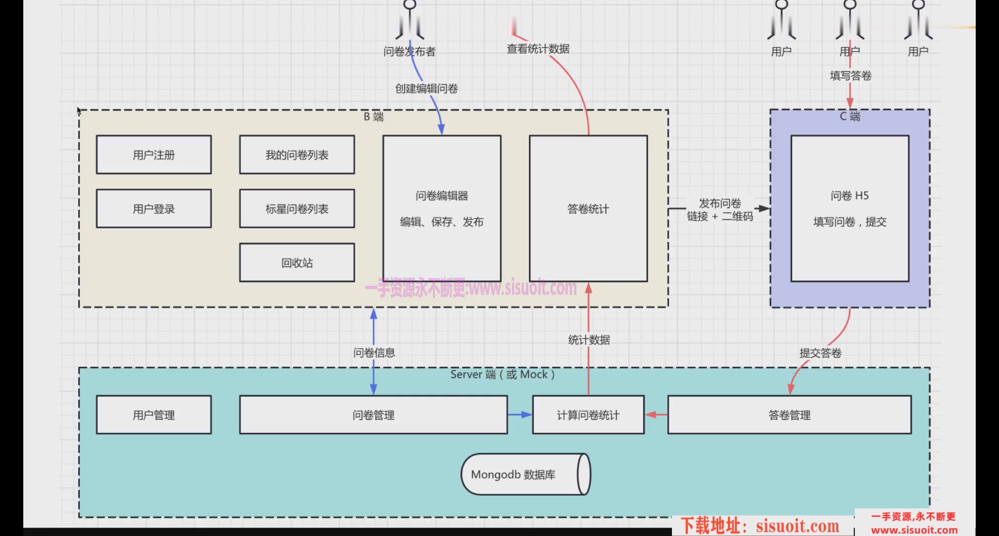

# 项目架构
## 布局文件夹——layouts
### MainLayout
* 总体页面布局
  * 头部导航栏
  * 中部内容
  * 底部导航栏

### Question
* 中部内容布局
  * 左侧菜单栏
  * 右侧对应列表页

## 页面文件夹——pages
* 首页：Home
* 登录页：Login
* 注册页：Register

* 问卷管理：manage
  * 我的问卷: /manage/list
  * 星标问卷: /manage/star
  * 回收站: /manage/trash
* 问卷详情: question
  * 编辑问卷: /question/edit
  * 问卷统计: /question/stat

* 404页面：NotFound

## 路由文件夹——router

# 选择第三方库的依据
1. github star和npm 下载量
2. github 代码更新时间 和 npm发布频率
3. 看文档和demo 是否通俗易懂（学习成本）
4. 实际体验，实现demo感受实际体验

## ui库 - antd-react

## '@reduxjs/toolkit'
* 内置immer功能，因此可以直接改state（否则要遵循不可变数据）

## 编辑问卷
* 编辑问卷: /question/edit
* 页面结构分为上下结构：header + main

* 头部（header）: 左侧返回按钮 + 中间工具栏按钮 + 右侧（保存+发布）按钮
* 中间工具栏按钮（EditToolbar）
  1. 删除按钮
  2. 隐藏按钮，控制改变组件中的isHidden属性来实现，中间画布需要先过滤isHidden为true的组件再循环渲染，同时需要控制右侧的属性面板的变化
  （让selectId指向下一个没有被隐藏的组件）
  3. 锁定/解锁按钮 => 锁定选中组件的状态（无法更改属性，除非解锁） => 改变store对应选中组件的isLocked属性，同时通过css样式来表达这种属性的变化
  （同时锁定对应的组件右侧的属性面板）
  4. 复制 => 找到当前选中的组件id，然后深拷贝选中组件并进行存储
  5. 粘贴 => 先判断store是否存在已复制的组件信息，如果有则将组件信息push到组件列表中
  6. 组件的上移和下移功能 => 实现方式与组件的拖拽类似
   - 添加拖拽功能后有可能与之前的功能冲突，比如快捷键复制和删除功能
   - 原因在于第三方库dnd-kit会为组件套上一层，需要修改样式 + 快捷键件的移动判断
  7. 撤销重做功能 - 使用第三方插件redux-undo => 详见redux_undo.md
   * present => 保存当前数据
   * past(undo-stack) => 历史数据列表
   * future(redo-stack) => 将来数据列表

* 工具栏添加快捷键功能
  1. 使用ahooks中的useKeyPress hook来实现，具体看useBindCanvasKeyPress.js文件
  2. 重点，需要判断当前光标所处的位置是否属于元素，而非输入框之类的元素，否则用户使用快捷键删文字的时候会误删组件元素

* 右侧保存按钮
  1. 保存功能：先找到对应的问卷id，再将store中存放的组件数据和页面信息数据，发送到服务端保存到数据库中
  2. 发布功能：先找到对应的问卷id，再数据（id + isPublished）更新到服务端，成功后跳转统计页面

* 左侧标题修改
  1. 标题显示组件抽离，根据edit状态来渲染不同的组件
  2. 回车或失焦时候，临时保存到store中

============ ===========

* main结构包含 左侧面板 + 中间画布 + 右侧组件信息

* 左侧面板（tabs）： 组件库 + 图层
* 组件库：
  1. 点击组件，添加组件到中间画布中
  2. 需要为每一个组件定义一个属性表单，属性会同步显示到右侧的组件信息中
  3. 快捷键保存，使用ahooks中的useKeyPress辅助
  4. 自动保存 (不等于定期保存),使用ahooks中的useDebounceEffect辅助，当组件信息或页面信息发送变化时候，自动触发保存函数，同时防抖

* 中间画布
  1. 文本框换行问题 => 参考questionParagraph =>component.jsx
  2. 拖拽排序功能 ：
  封装 SortSortableContainer 和 SortableItem 组件
  使用在图层和画布中

* 右侧组件信息
  1. 同步显示中间画布选中的组件信息（根据selectedId显示）
  2. 在右侧的这个面板中修改组件信息，也会同步到中间画布中去（）

=====
## 问卷统计模块
* Q: 问卷or答卷
* Q：B端orC端
* A：问卷即本项目所制作的一切，创建+编辑+发布问卷，属于问卷发布者（b端）
* A：答卷即问卷发布者（b端）编写发布问卷后生成的h5链接or二维码，给c端用户填写、提交答卷，最后汇总统计答卷结果

* 一个问卷，对应多个答卷
* 一个问卷发布以后，可收集很多答卷
* 发布者可以实时看到所有答卷信息（业务闭环）

### 需求分析
 #### 界面的模块
 - 顶部栏
 - 左侧 组件列表
 - 中间 答卷列表
 - 右侧 图表统计

 #### 功能列表
 1. 顶部栏
 - 返回
 - 显示标题
 - 显示h5 url
 - 复制url 按钮 - 获取dom，选中dom，复制dom内容
 - 显示二维码 按钮 - 使用第三方插件qrcode.react
 - 编辑问卷按钮

 2. 左侧 组件列表
 - 显示组件列表
 - 点击选中组件（和中间答卷列表的表头联动） => 因此，左侧列表的组件id要与中间表格获取的组件id一致，如果服务端采用mockjs模拟数据则需要在这块写死

 3. 中间 答卷列表
 -  显示答卷数量
 -  显示答卷表格，分页
 -  点击表头选中组件（和左侧组件列表联动）

 4. 右侧 图表统计
 - 根据选中的组件，显示图表统计
